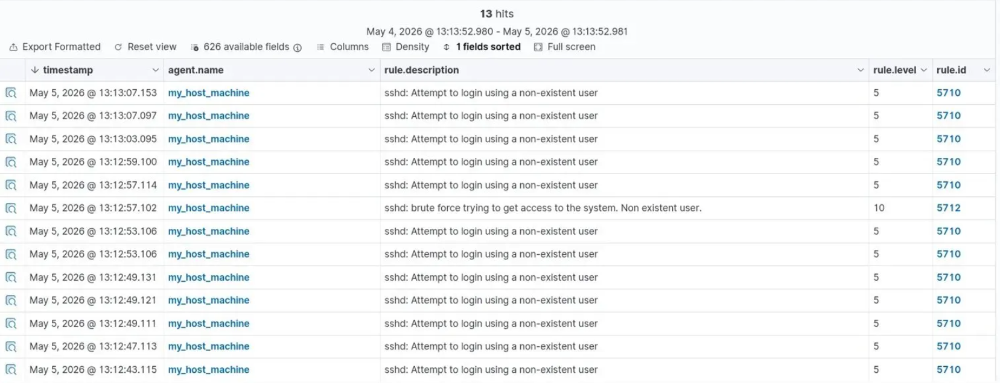
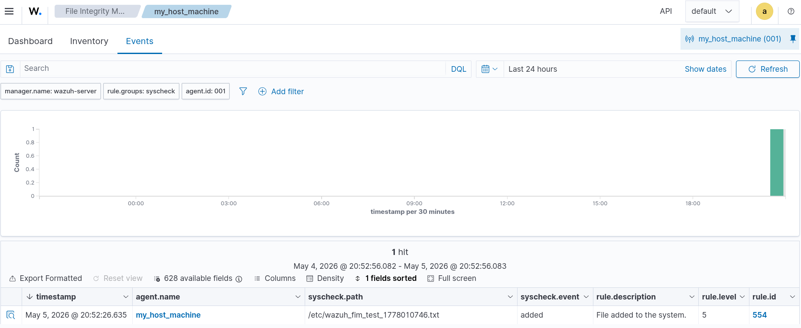
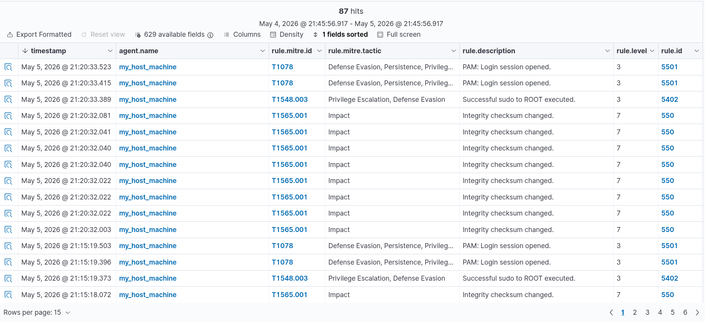

# 🛡️ Home Lab SOC — Wazuh SIEM

A personal cybersecurity home lab simulating a real SOC (Security Operations Center) environment using Wazuh as the SIEM platform. Built to practice blue team skills including threat detection, log analysis, file integrity monitoring, and MITRE ATT&CK mapping.

---

## Architecture

```
┌─────────────────────┐         ┌──────────────────────┐
│   Wazuh Server      │◄────────│  Agent (Fedora Linux) │
│   (VirtualBox VM)   │  logs   │  my_host_machine      │
│   Dashboard + SIEM  │         │                       │
└─────────────────────┘         └──────────────────────┘
```

- **Wazuh Server** — deployed as OVA in VirtualBox, hosts the full Wazuh stack (manager + dashboard)
- **Agent** — installed on a Fedora Linux host machine, sends logs and events to the server in real time

---

## Simulated Attacks & Results

### 1. SSH Brute Force Attack
Simulated repeated failed SSH login attempts using a non-existent user.

**What Wazuh detected:**
- Rule 5710 (level 5) — "Attempt to login using a non-existent user" — triggered per attempt
- Rule 5712 (level 10) — "Brute force trying to get access to the system" — triggered automatically after correlating multiple failures

Wazuh escalated severity from level 5 to level 10 by recognizing the brute force **pattern** across multiple events, not just individual failures.



---

### 2. File Integrity Monitoring (FIM)
Configured Wazuh to monitor `/etc` in real time for any file system changes.

**What Wazuh detected:**
- Rule 554 — "File added to the system" — triggered immediately upon file creation
- Syscheck event type: `added`
- Path monitored: `/etc/wazuh_fim_test.txt`



---

### 3. MITRE ATT&CK Mapping
Wazuh automatically maps detected events to the MITRE ATT&CK framework.

**Techniques detected:**
| Technique | Tactic | Description |
|-----------|--------|-------------|
| T1078 | Defense Evasion, Persistence, Privilege Escalation | Valid accounts — PAM login session |
| T1548.003 | Privilege Escalation, Defense Evasion | Sudo and sudo caching — successful sudo to ROOT |
| T1565.001 | Impact | Stored data manipulation — integrity checksum changed |



---

### 4. Security Configuration Assessment (SCA)
Wazuh automatically audited the system against the CIS Benchmark for Linux.

**Results:**
- Total checks: 190
- Passed: 90
- Failed: 95
- Security score: 48/100

This highlights real misconfigurations on the system and maps each failed check to a remediation action.

---

## Key Skills Demonstrated

- SIEM deployment and configuration (Wazuh)
- Linux agent setup and management
- Real-time log collection and analysis
- Threat detection via rule correlation
- File integrity monitoring
- MITRE ATT&CK framework mapping
- Security Configuration Assessment (CIS Benchmark)

---

## Tools Used

- Wazuh 4.x (OVA deployment)
- VirtualBox
- Fedora Linux
- OpenSSH

---

## Disclaimer

> This lab was built for educational purposes on systems I own.  
> All simulated attacks were performed in a controlled local environment.

---

## Author

**Elhyani Abderrahman**  
1st year Engineering Student — Cybersecurity, ENSAM Casablanca  
[LinkedIn](https://www.linkedin.com/in/abderrahman-el-hyani-b2a393398/) · [GitHub](https://github.com/PENTAGONISTE)
